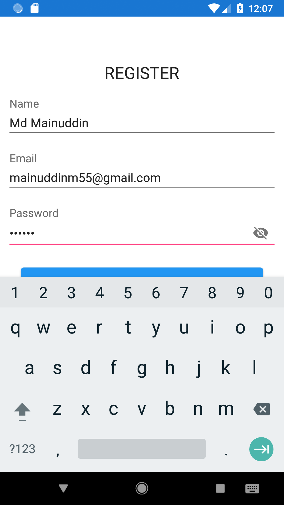
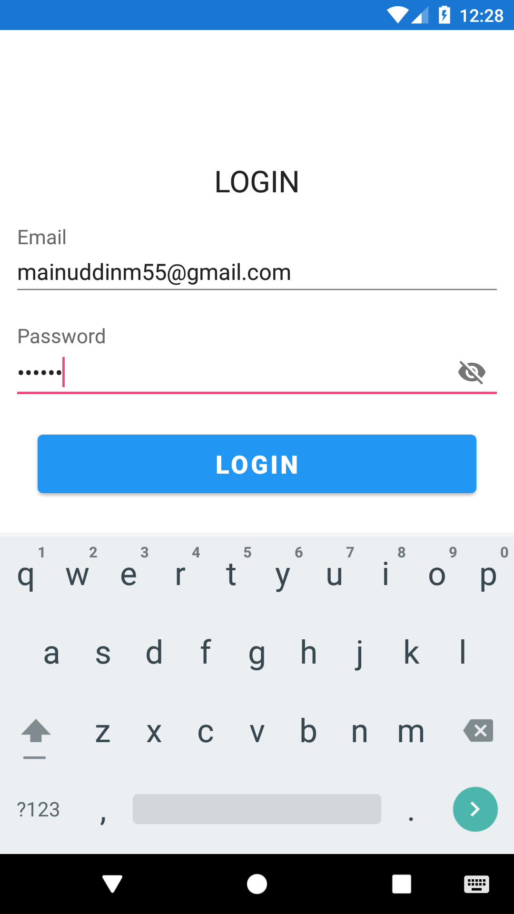
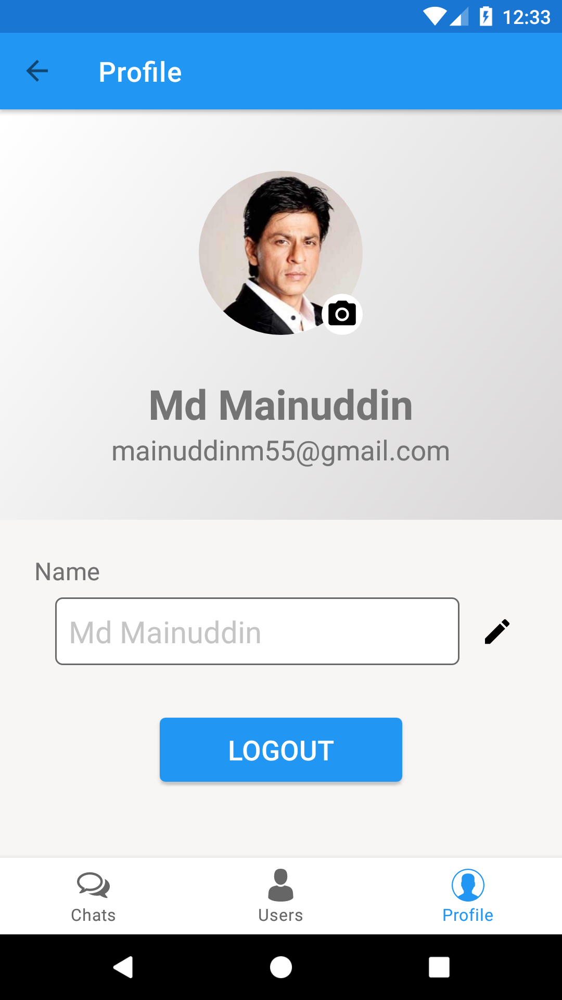

# MiniChat

# Reginstration Method:
1) Email & Password
2) Facebook
3) Google play account

# Registration

# Login

# Chat List
User list which you chat with
#

# User List
 All app user list expect you
#

# User Profile
User can update name & profile photo
#

# Chat user online status
#

# Chat user typing status
#

# Chat use message seen status
#

